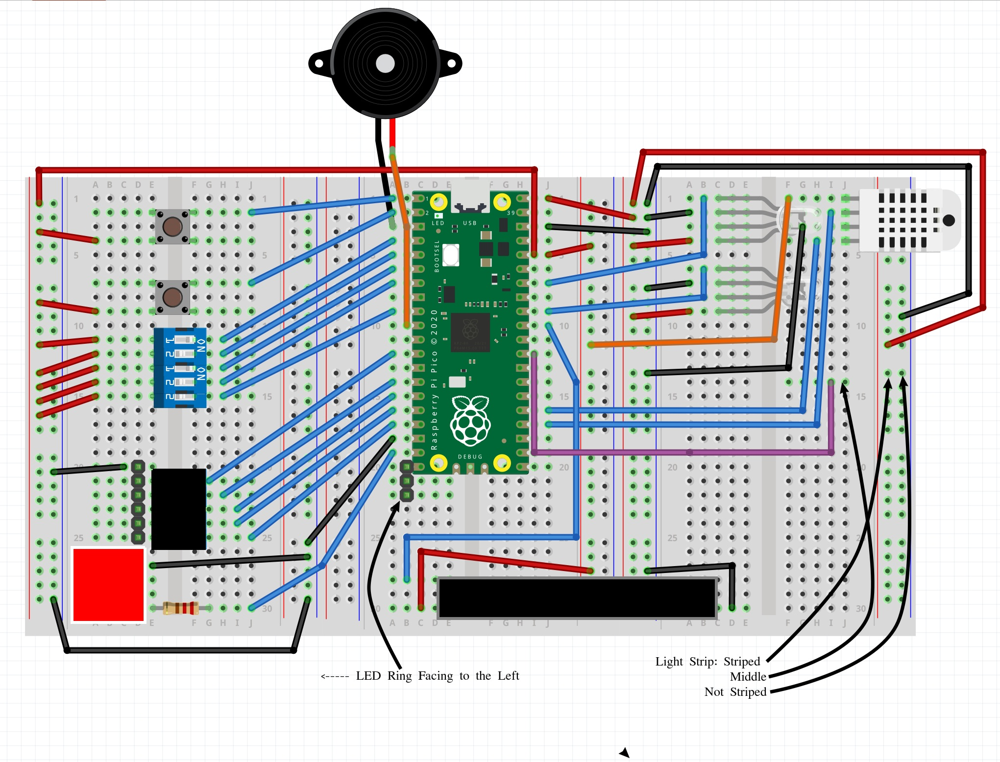

# pico-xmas 2023 Alternative Advent Calendar Project

giles' final project for the RaspberryPi Pico from the XMas Advent
Calendar 2023.

This one project endeavours to include all of the components from the
2023 PiHut XMas Advent Calendar.

See [PiHut Calendar 2023 Guides](https://thepihut.com/pages/maker-advent-2023-guides)

Here is a video of what I have so far. Shot a couple of days before the final
version.

## Setup

First you need to wire all your components together. I used a couple of extras:

- an extra breadboard from last years calendar, this is required as there is
  not enough room otherwise. You can buy these for a few pounds in the UK.
- the piezoelectric buzzer from the 2022 calendar, this is not required but
  but it allows you to play a christmas tune while viewing the lights.

Here is a wiring diagram:

[]

