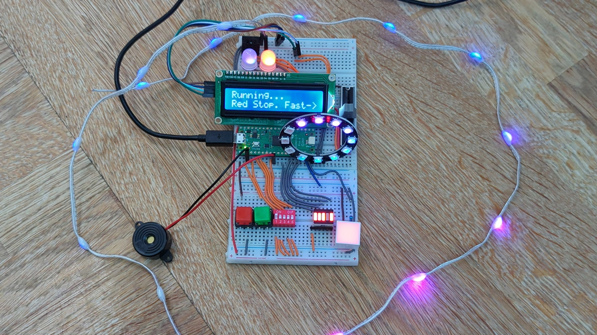

# pico-xmas 2023 Alternative Advent Calendar Project

giles' final project for the RaspberryPi Pico from the XMas Advent
Calendar 2023.

This one project endeavours to include all of the components from the
2023 PiHut XMas Advent Calendar.

See [PiHut Calendar 2023 Guides](https://thepihut.com/pages/maker-advent-2023-guides) for PiHut's guides for day.

Click the image below for a video of the final version of the project.

[](https://youtu.be/fkIc-2vTdf8 "Let It Glow Advent Calenar")

## Setup

### Wire up your board

First you need to wire all your components together. I used a few extras:

- an extra breadboard from last years calendar, this is required as there is
  not enough room otherwise. You can buy these for a few pounds in the UK.
- the piezoelectric buzzer from the 2022 calendar, this is not required but
  but it allows you to play a christmas tune while viewing the lights.
- I substituted in a wire kit from Amazon for the jumper wires that
  came with the calendar. This is not essential but makes the project
  tidier and the circuits easier to follow.

See the [below](#purchase-the-parts) to obtain the parts.

When wiring up the board it may help to refer back to the PiHut guides for each
component as they describe what each pin does, etc.
See [PiHut Calendar 2023 Guides](https://thepihut.com/pages/maker-advent-2023-guides)See the below to obtain the parts.

Here is the wiring diagram:


### Install the tools

Because this is a complex project with multiple submodules, Thonny is a little
difficult to use. Instead we will use the choice of many professional
developers: Visual Studio Code.

You will also need to install git which is the version control client for
GitHub repositories like this one.

- See here for installing vscode: [Visual Studio Code](https://code.visualstudio.com/learn/get-started/basics)
- See here for installing git: [Git](https://git-scm.com/book/en/v2/Getting-Started-Installing-Git)

One other tool we will be using is the MicroPico extension for vscode. This
allows us to work on MicroPython projects and upload them to the Pico. This
extension should be automatically added for you when you open my project. You
can read about it here: [MicroPico](https://marketplace.visualstudio.com/items?itemName=marus25.cortex-debug)

### Some preparation

NOTE: everything we are using here is compatible with Windows, Linux and MacOS. I have tested these instructions on Linux. If you get any issues I can probably help, drop a question here:
[Pico Advent Calendar Discussions](https://github.com/gilesknap/pico-xmas/discussions/4)

The pico needs to have MicroPython firmware installed on it.
To install it I used the following steps:


Go here and download the latest UF2 file:
https://micropython.org/download/RPI_PICO/

Plug in your PICO while holding the BOOTSEL button. You will find that it
opens as a USB drive. Copy the above UF2 file to the drive and wait for it to
reboot.

### If you are not on Windows

**Linux Users** will need to add their user to the dialout group to get access to
the USB serial port that the PICO uses to communicate with the host. This is
done using the following command:

```bash
sudo adduser <your_user_name> dialout
# now reboot your PC (logout is not enough)
```

I'm pretty sure **Windows Users** don't need to do anything special.
**MacOS Users** may also need to set the dialout group membership.

### Get the project onto your pico

Now we want to get the project onto your pico. To do this we need to clone the
project from GitHub, open it in vscode and then upload it to the pico.

Note
that I use vscode to get the initial terminal window, this is because it
provides the most consistent experience across platforms - but you can use
your favourite terminal if you prefer for the first steps.

Follow these steps:

1. Open vscode
1. Open a terminal window inside vscode (Ctrl+Shift+` or View->Terminal)
1. Clone the project from GitHub using the following command:
   ```bash
   git clone https://github.com/gilesknap/pico-xmas2.git
    ```
1. Open the project in vscode using the following command:
    ```bash
    code pico-xmas2
    # this opens a new vscode window, you can close the old one
    ```
1. You will be asked if you trust the Author, click yes
1. You will be asked if you want to install the recommended extensions, click yes
1. Now plug in your pico.
1. You should see a message towards the left of the bottom status bar saying
   "Pico connected"
1. Upload the whole project to the Pico by right clicking in the file explorer
   pane (to the left of vscode window) and selecting "Upload project to Pico".
1. Select the "main.py" file which is the entry point for the project.
1. Chose the "Run" command on the status bar at the bottom of the window.


## What the Code can do

So the idea here is that you can pick the 'mode' by setting the dip switches and
start and stop the code using the green and red buttons respectively. You can
also use the slider to speed up or slow down operation.

The code is structured using modules and classes for reusability. It also uses
asyncio for parallel operation so that it can drive all of the output devices and
monitor all of the input devices simultaneously.

I have written 4 'modes' so far,  I will be accepting PRs to add some more if anyone
feels like contributing.

I was considering some games where you have to repeat sequences etc.

Current modes are as follows: (note you need to use binary to select them!):

```
0: Colour Cycle
1: Colour Fading Loops
2: Colour Cycle with Music
3: Colour Fading Loops with Music
```

## Experimenting with the code.

If you want to play around with making changes to the code then here are a
few tips:

- changing main.py just requires that you, save your changes, select main.py
   in the file explorer and then click the `Run` button on the status bar at the
   bottom of the window.
- changing any of the other files requires that you:
  - save your changes
  - click `Reset` on the status bar at the bottom of the window.
  - upload the project to the pico again
  - select main.py in the file explorer
  - click the `Run` button
- if things seem to go wrong then this often clears any issues:
  - click `All commands` -> `Delete all files from board`
  - click `All commands` -> `Reset> Hard`
  - repeat the upload and run steps above
- You can run your code standalone because the pico will always try to run
  main.py when it starts up. This means you can unplug it from your PC and
  power it from a USB power supply or battery pack.

## How to get help

If you have any questions or problems please raise an issue here
[Pico Advent Calendar Discussions](https://github.com/gilesknap/pico-xmas/discussions/4)

The above link is also a good place to add any suggestions for improvements or
new modes you can think of.

## Purchase the parts

I did not use the jumper wires that came with the calendar because they don't
scale well to a more complex project like this. I bought a little jumper wire
kit from Amazon for a few pounds.
[This is the one I bought](https://www.amazon.co.uk/dp/B08PF2W1RF?psc=1&ref=ppx_yo2ov_dt_b_product_details)

If you want to buy one of the calendars with all the parts then you can get it here (I don't know if they sell all year round?):
[PiHut XMas Advent Calendar 2023](https://thepihut.com/products/maker-advent-calendar-let-it-glow-inc-raspberry-pi-pico-h)

Alternatively you might be able to buy the parts individually from the PiHut
and other suppliers. This is PiHut's list of parts (sorry no part numbers):

- Day 1
   - 1x Raspberry Pi Pico H
   - **3x** Half-size breadboard (one extra)
   - 1x Micro-USB Cable
- Day 2
   - 1x Diffused red 15mm block LED
   - 1x 100 ohm resistor
   - 2x Male-to-male jumper wires
- Day 3
   - 2x 12mm Square Tactile Buttons
   - 2x Colourful Button caps
   - 5x Male-to-male jumper wires
- Day 4
   - 1x 5-segment Bar Graph display
   - 1x Network resistor
   - 6x Male-to-male jumper wires
- Day 5
   - 1x 5-way DIP switch
   - 5x Male-to-male jumper wires
- Day 6
   - 2x 10mm Addressable RGB LEDs
   - 6x Male-to-male jumper wires
- Day 7
   - 1x 45mm Slide potentiometer
   - 3x Male-to-male jumper wires
- Day 8
   - 1x 12-LED Addressable RGB LED Ring with pre-soldered headers
   - 3x Male-to-male jumper wires
- Day 9
   - 1x DHT20/AHT20 I2C Temperature & humidity sensor
   - 4x Male-to-male jumper wires
   - Day 10
   - 1x Dot strand addressable LED string lights (~15 LED) with jumper wire headers
- Day 11
   - ~~1x Membrane keypad (1x4)~~ (not used)
   - 1x 5-pin extra-long pin header
   - 5x Male-to-male jumper wires
- Day 12
   - 1x 16x2 LCD Display with I2C backpack (pre-soldered)
   - 4x Male-to-female jumper wires

